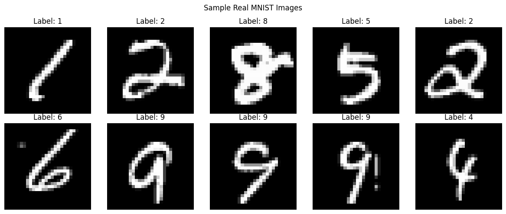
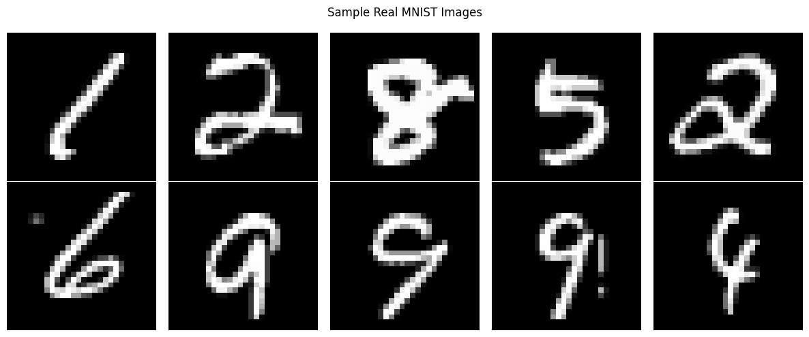

# Generative Image Modeling with GANs and Diffusion Models

## Overview

This repository contains a course assignment focused on generative image modeling for the MNIST handwritten-digit dataset. The work covers adversarial generative modeling with GANs and conditional GANs, stable adversarial training with Wasserstein GANs, and denoising diffusion modeling with a lightweight DDPM-based U-Net. The project is organized into three main sections, with the final section including two architectural variants that extend the baseline DDPM implementation.

## Project Structure

```text
.
├── README.md
├── 01_Adversarial_Image_Generation_GAN_cGAN.ipynb
├── 02_Wasserstein_GAN_Training_Stability.ipynb
├── 03_DDPM_Baseline_Diffusion_Model.ipynb
├── 04_DDPM_SiLU_Activation_Variant.ipynb
├── 05_DDPM_Skip_Connection_U_Net_Variant.ipynb
├── data/
├── models/
└── .gitignore
```

- 01 → GAN + cGAN
- 02 → WGAN
- 03 → Baseline DDPM
- 04 → DDPM + SiLU
- 05 → DDPM + Skip Connections

Note: notebooks 04 and 05 are architectural variants of Section 3, not separate assignment sections.

## 1. Adversarial Image Generation

### Vanilla GAN

The first notebook implements a Vanilla GAN for MNIST. The generator takes a latent random noise vector and maps it through fully connected layers with LeakyReLU activations, ending with a Tanh output layer to produce a 28×28 grayscale image. The discriminator receives a 28×28 image, processes it with fully connected layers and LeakyReLU activations, and produces a sigmoid-based real/fake prediction.

### Conditional GAN (cGAN)

This notebook also extends the GAN into a Conditional GAN (cGAN) by supplying class-label information to both the generator and discriminator. In this setup, the generator is conditioned on a desired digit class, and the discriminator evaluates generated or real images together with their class information. This allows the model to generate samples associated with a specific MNIST digit.

## 2. Wasserstein GAN

The second notebook implements a Wasserstein GAN (WGAN) for MNIST. It follows the conceptual changes required for Wasserstein training: the discriminator is replaced by a critic, the sigmoid output is removed, and the critic produces a raw scalar score instead of a probability. The binary cross-entropy objective is replaced with the Wasserstein objective, and the critic is trained multiple times for each generator update while applying weight clipping to satisfy the Lipschitz constraint. The notebook uses RMSprop as the optimizer and includes the corresponding training/loss visualization required by the assignment.

## 3. Denoising Diffusion Probabilistic Model

Section 3 implements a Denoising Diffusion Probabilistic Model (DDPM) for MNIST. The workflow follows the standard forward and reverse diffusion process: images are progressively corrupted by Gaussian noise according to a linear beta schedule, and a neural network learns to predict the noise added at each timestep. The reverse process then iteratively removes that noise to generate samples.

### Baseline DDPM

The baseline notebook uses a lightweight U-Net-based architecture for noise prediction. The model is conditioned on timestep information, uses a convolutional encoder, a middle block, and a decoder with transposed convolutions to reconstruct the predicted noise. Training uses an MSE objective between the predicted noise and the actual noise added during the forward diffusion process.

### SiLU Activation Variant

The notebook 04_DDPM_SiLU_Activation_Variant.ipynb is derived from the baseline DDPM and explores a modification of the architecture where the activation function is replaced with SiLU. It is not a separate diffusion model or a separate assignment section; it is a Section 3 variant that keeps the overall DDPM pipeline while changing the activation choice in the noise-prediction network.

### Skip-Connection U-Net Variant

The notebook 05_DDPM_Skip_Connection_U_Net_Variant.ipynb is another architectural variant of the DDPM model in Section 3. It preserves the same diffusion setup but modifies the U-Net with skip connections to preserve spatial detail through the encoder-decoder path. This is not treated as a separate project section; it is a variant of the DDPM noise-prediction architecture.

## Dataset

The project uses the MNIST handwritten-digit dataset. The notebooks work with grayscale 28×28 digit images spanning classes 0 through 9.

## Technologies Used

- Python
- PyTorch
- Torchvision
- NumPy
- Matplotlib
- Jupyter Notebook

## Key Concepts Implemented

- GAN training for image generation
- Conditional image generation with class conditioning
- WGAN critic-based training and Wasserstein objective
- Weight clipping for Lipschitz enforcement
- Forward diffusion with a linear beta schedule
- Reverse diffusion / denoising process
- U-Net noise prediction for diffusion models
- Architectural variants for DDPM: SiLU activation and skip connections

## Results and Visualizations

The notebooks include the project’s existing qualitative results and visualizations, such as:

- generated MNIST samples from the GAN and cGAN models
- generated sample outputs across training epochs
- class-conditioned cGAN samples
- WGAN loss curves and training diagnostics
- forward diffusion visualizations showing increasing noise levels
- denoising / reverse-sampling demonstrations
- generated DDPM samples from the baseline and variant notebooks

These results are preserved as they appear in the existing notebooks; no additional claims, metrics, or experimental improvements are introduced in this README.

### Sample Outputs from the Notebooks

These are representative outputs extracted from the existing notebook results.





